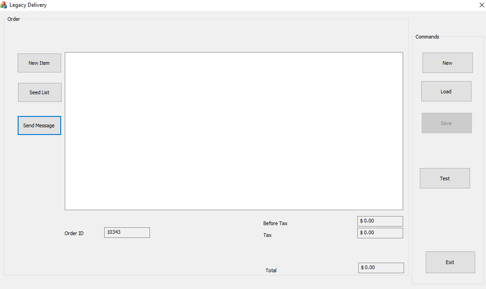
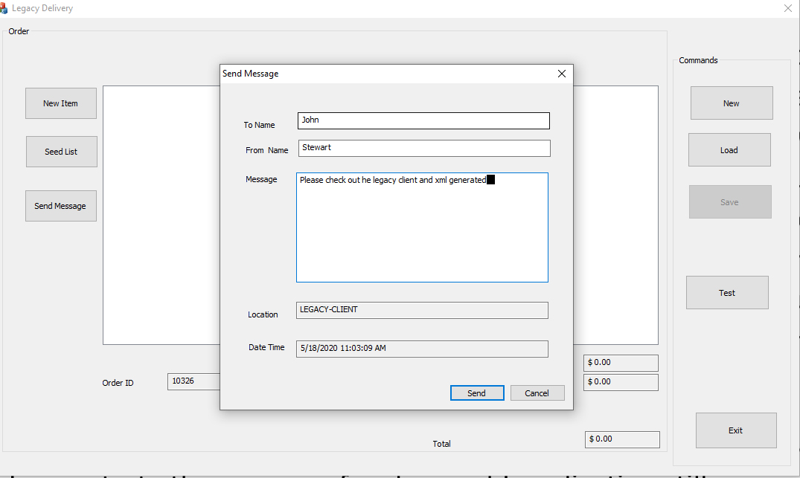
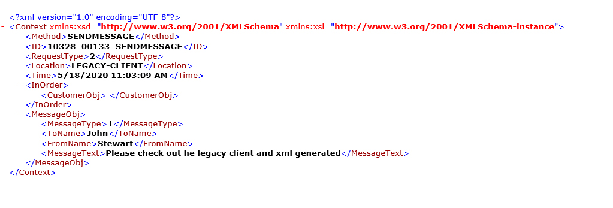
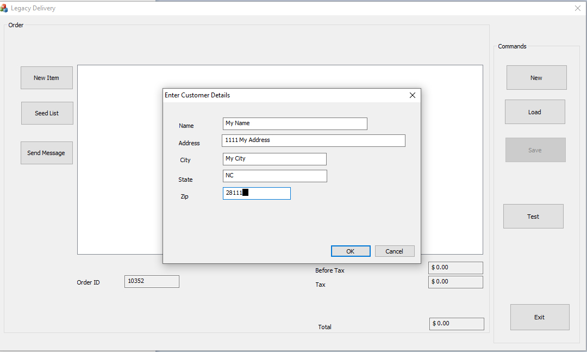
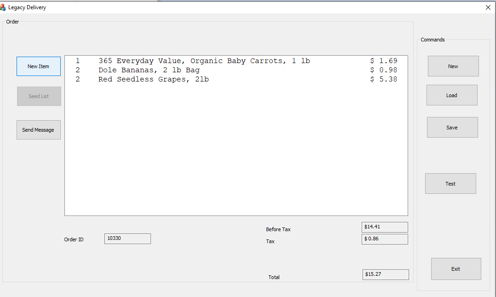
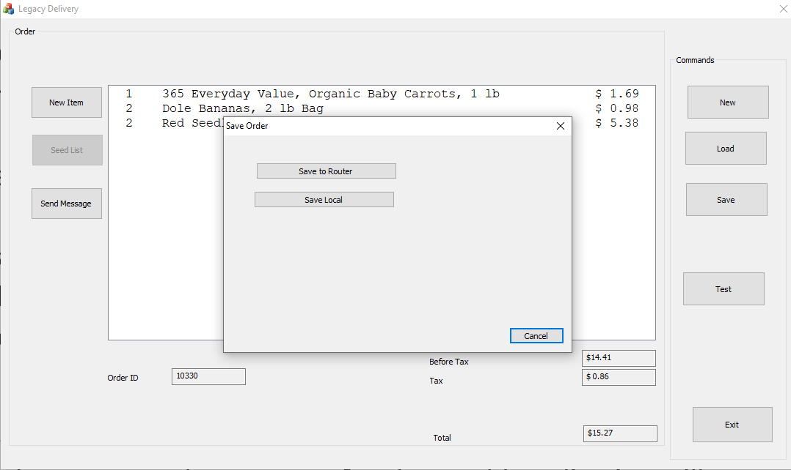
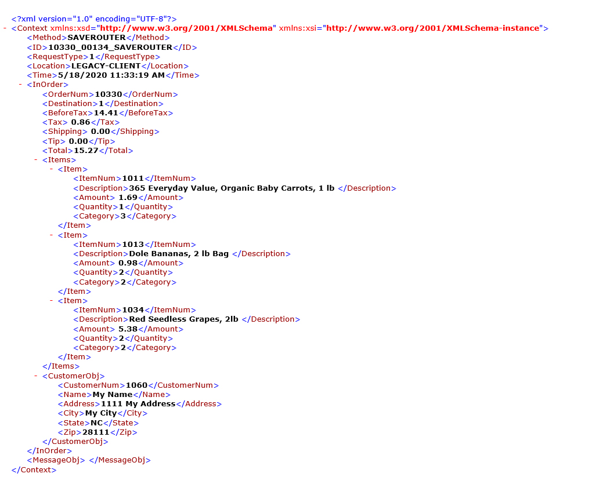

Stewart Hyde
============

### Introduction

This is old style MFC C++ application which I created to demonstrate the
techniques of modernizing the old application with newer services and better
support. In the real world this application could made of multiple screens and
DLL’s written by different developers and with each having it own logging and
possible own DLL. Before modernizing the old application, it best to combine the
DLL’s into fewer DLL’s which make it easier to common logic. It may take the
time to modernize the entire old application so part of the design goals of this
project is to make the old Legacy application written in Microsoft Visual Studio
2008 compatible with a modern Microsoft .Net Core 3.1 application using Visual
Studio 2019. Also, when a large old application is out in field, it can be
difficult to track down errors and especially exception in code. A call stack is
provided but requires debug code and PDB’s

This sample application was created from scratch and does not have existing
database logic. But the idea of this project is demonstrating the process of
make an old application still compatible with a newer generation application and
communicates with data. This application was not designed to be on the internet
and does and does not have the appearance and flexibility of web applications.

The following modernization techniques are demonstrated in this application

-   Logging via .Net 3.5 Bridge.dll which supports log4net logging in C++ code.
    I was hoping to replace log4net with newer .Net Core Logging which has more
    abilities but initial findings, I found that it was too slow using a
    technique simpler to GetServiceXML method. I believe an ideal method for
    larger application would be memory transfer to a service which can handle
    the logging in more efficient manner. If done right – this could even
    include information that would allow structure logging so problems can be
    track down better.

-   Enhance call stack logging available for exception and developer demand

-   Ability to call .Net Core 3.1 service request from C++ via the .Net 3.5
    Bridge.dll and .Net Core 3.1 GetServiceXML.exe

-   Ability to router data to server via a .Net Core 3.1 Router via simple XML.
    This is use for both orders and messages.

-   Similar a WinForm application is provided as an attempt to integrated legacy
    .Net windows forms into the idea.

### Compile considerations

To compile VS 2008 Code, you will need Microsoft Visual Studio 2008. To run the
code, you need registered the bridge.dll with regasm.dll. If there is a desired
to change exposed interface for bridge.dll or make a similar on using COM
exposed interface. You need to run tlbexp on the dill to create TLB file.

The .Net core executables are contain within the netcoreapp3.1 directory in bin
directory

### Winform example

I desired to try to see how an WinForm application similar to C++ application
would fit into the idea of this project. I found the following issues

1.  .Net Core WinForm is not ready for prime time and had to eliminate the idea

2.  Converting the DeliverySupport to .Net Standard 2.0 and linking work, but
    had issue connected to Dapper. Likely dependency issues.

3.  Logging using Microsoft Logging using dependency did not work in Framework.

4.  Decide to use XML techniques of C++ version and using GetServiceXML and
    OrderRouterService.exe for communications.

### Example screens

The following is Legacy application main screen.

This is screen popup to send message

A screenshot of a social media post Description automatically generated

The following is example of xml generated when sending message

A screenshot of a social media post Description automatically generated

This is the screen to add customer information when new order or new item

This is screen for adding a new item to order, item list is retried via
GetServiceXML and retrieved from database via SQLServer

A screenshot of a social media post Description automatically generated

This is screen after adding some items to order

A screenshot of a cell phone Description automatically generated

The following screen for saving the order – only real option now is for the
router since logic for C++ to get XML is currently not added because I am trying
to focus on using new technology and dealing with older technology takes time.

A screenshot of a cell phone Description automatically generated

The following is example of the XML that C++ application will place in the
Router’s directory to send to server

A screenshot of a cell phone Description automatically generated

There is a so screen to test exception stack and call stack logging. Exception
is done by divide by zero test and option to manually do a call stack.

A screenshot of a social media post Description automatically generated
