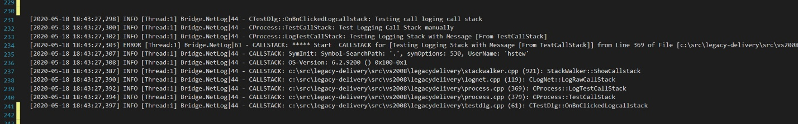
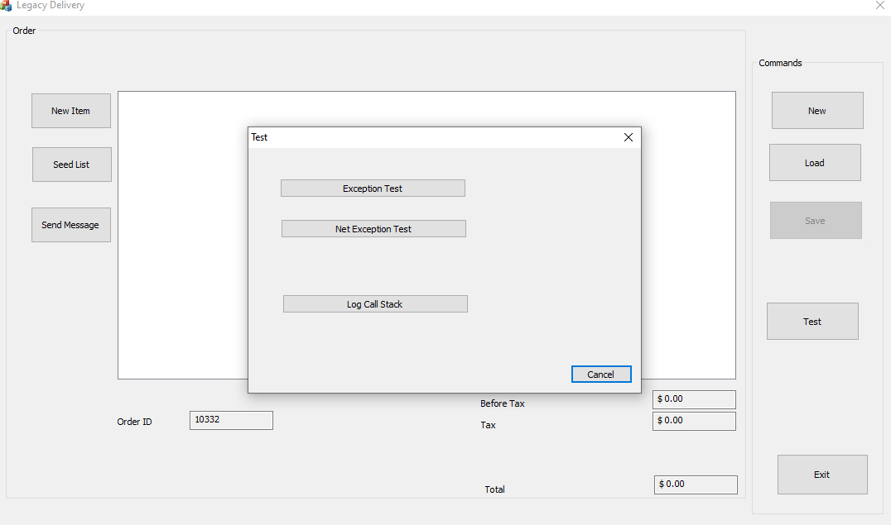
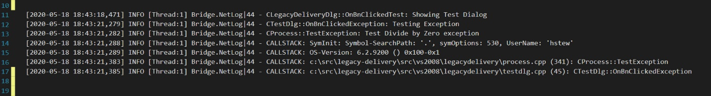
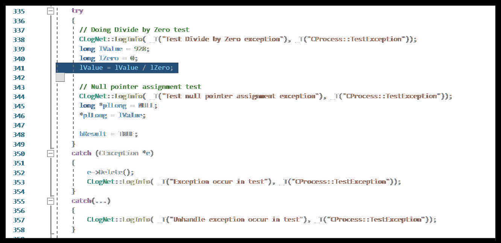
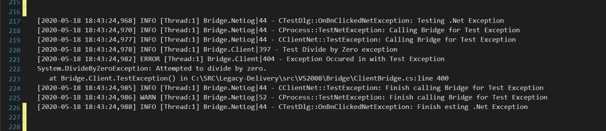
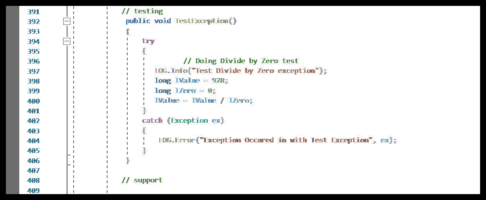

Stewart Hyde
============

### *Introduction*

This document I hope is what this entire project is all about. In a real world,
Legacy application maybe something totally different than what is provided in
this project. But my hope is that this project gives developers some insights on
what is possible. In an ideal world, it may not possible to start from scratch
on a project but if it can change so over time older software can use new
development platforms which allow other developers to share in the project and
make enhancements.

Please note this is primary for older C++ platform, .Net already has enhanced
logging and stack tracking for example and this does not apply. Also, a lot of
these processes depend on the state of development of your legacy software and
may or may not applied.

### *Goals*

-   Preparing Legacy Application for modernization

-   Centralizing Legacy Application logging for better diagnostics

-   Enhancing Application Logging with better call stack tracking handling

-   Determining best techniques for modernizing specific to the application

-   Creating an application development to move application to entirely more
    modern architexture.

-   Possible Agile Process for implementing such changes

### *Preparing Legacy Application for modernization*

A lot of this depends on the application that is has old legacy code, but for
the sake of this discussion it mainly applies for C++ code. Yes some of this can
be related newer technologies like Windows .Net Forms, but C++ is where the
problem is worst and a lot of this because there are less developers in C++ area
to work on this code and easier to get developers to code in .Net now days.

Important areas to think about is User Interface and Database logic and
specifically removing the database logic from the user interface code. This can
be challenge because often the logic is in same code.

But before changes are to make, I believe it important to make to sure the base
code is ready for change. For example, if the project is divided up in many
different dll’s, it may be important that that these dll’s are combine so it
changes can be made easier.

Also, I believe it is important that if code is production that change can be
made so that it does not alter process of production and aid in solving
production issues. This is one of reasons why a centralize logger is so
important and initial stages of this transformation. The logic for logging use
ability for .net class interface to imported into C++ application via the COM
interface. This may not be ideal, but it was found with Visual Studio 2008 this
was the best option to handle it. It also uses with talking to some of .Net Core
services by shelling out and calling GetServicesXML. Initially the planned was
to use Google Protocol and pass objects but for this project, it was simpler to
use xml file to past information. Depending on application designed it maybe
better just to write the data to xml file and let a service like
OrderRouterService send information to modern API.

The goal is move legacy to new modernize platform while keeping the legacy
platform still upward compatible with more modern platform. New functionality
should be aim at working together with modernized platform. User interface can
be a challenge especially if entire application depends on it.

### *Centralizing Legacy Application logging for better diagnostics*

Centralize logging can be an extremely powerful way off tracking down issues in
older application, especially if you have release code out in field and do not
know why it is happening. Just that there is a problem reported in field. One
you have application prepared above you can log. In my history of logging, I
used Log4Net which can be called with .net 3.5. Ideally with new technology it
would nice to used more advance logging like SeriLog but this currently made be
difficult at least with .Net Core. One trick I figured out with Log4net is with
naming of Config file. Typically the config for is formatted as
appname.exe.config, but I found with C++ application naming as appname.Config
allows it use the configuration.

No matter what logging api you used, a couple of things I found was help is the
followings

1.  Use of static class in C++ for handling of logging function.

2.  Use of \__LINE_\_ and \__FILE_\_ in define macro for call to help include
    line information on calls

3.  Including the function name in logging function, since call function is
    class information is not provided in language.

4.  Both C++ and same process .net logging are provide in same log file

The following is example that demonstrates the above example in log file

*Enhancing Application Logging with better call stack tracking handling*

Exception handling can be a major issue with C++, because unlike .net, there is
not a good call stack log when problems happen out in the field so you are have
either a problem that can not be explained to explained or application crash. If
application already has a centralized logging in place in system, there is some
hooks that can be applied and allow system to logged called stack. A lot of this
depends of if you have debug symbols available and such. Code can be setup so
that it intercepts the try/catch in C++ and allows the call stack to be log at
time of the exception. Basically, when the processor detects and illegal
operation, the processor fires off an Int 6 interrupt and this is intercepted
and past back to application to handle the exception. I have personally used
this interrupt to trap read-only registers of EGA graphic CPU to record the
state of the ports so they can be preserved between screens switches. But this
has been incorporated into the Windows API especially with ToolHelp API. For
Visual C++ application, this can be best handle by code provided by following
CodeProject article

<https://www.codeproject.com/articles/11132/walking-the-callstack-2>

In the Legacy Application, I have included a special dialog for testing system
with error. This can be found in the CTestDlg as shown below.

This example provided 3 such tests in example which of course in real life would
not be control in a dialog like this but actual done instead when errors happen
on system.

The first example, uses the call stack API handle with CodeProject routine which
is also linked in with centralized logging in application to write the logs

In this example above, the call stack indicates the exception occurred on line
341 in routine CProcess::TestException which was called from Line 45 of
CTestDlg::OnBtnClickedException. Following show code that and why it has
exception.

The next example demonstrates an exception in .net code that is called from C++
code as with the bridge.dll, if application is shells out to .net code like
getservicexml.exe this will not apply. So, this is still for old code using .net
3.5 compiled with C++.

In this example, you see the code show it comes from line 400 of bridge.dll in
clientbridge.cs and .net indicates that it divides by zero exception. It is nice
that this logging includes both .net and C++ in the logging. The following code
show why it has exception

Often, in determining problems you do not know why the problem happens in field,
and it may not be reproducible in a test environment. But if you have an idea
you can temporarily add code to log the call stack when a specific code
situation happens to determine why it gets to code. This is especially useful if
the code is called from many different callers and it unknown which is causing
the problem. The following example shows call stack when manual inserting a call
to log the call stack.

One thing to note about call stack logging, is that it adds additional logging
so it can add a lot of logging so be careful especially in time sensitive
locations.

*Determining best techniques for modernizing specific to the application*

*This is where is becomes dependent on the legacy application, for this GitHub
example I did not want to spend much time on C++ storage areas of application
for example ADO to access database. I took the approach that in this example
application that the existence database logic was not relevant to modern
application and primary requirement was the existing data need to be transfer in
and out of the two applications. For example, Items, Orders, and messages but
the modern application could have function that the legacy does not have like
images for items and working across multiple devices concurrently.*

*The plan was use one to use router which would router XML saved from legacy
application like orders and transfer them to modern application though the same
database logic that the modernize application uses. Also, that the items being
used by legacy application were the same items use by the modern application.
This is done in two ways*

1.  Existing items can be seeded to new modern database from command on legacy
    application. The legacy application creates an XML which would be transfer
    information to modern database

2.  When user pulls down items to add to order, the list of items is pulled from
    the modern database

User interface portion of project is different, it can be confusing to the user
with mix of user designed and best option is a completely designed. This is one
of reasons why in this project, I decided to work on the legacy application
first and then move to challenges of modern application. But the learning
process of doing this shows the importance of keeping the data separate from the
user interface code.

The planned from the start was use .Net Core 3.1 database from beginning of the
project. At the beginning of the project Entity Framework was used from the
start. But development process of modern user interface has shown that Dapper
was better way to handle the implementation, but the basic interface of class
was kept the same. This proved to be advantage when putting the web application
on Azure.

### *Creating an application development to move application to entirely more modern architexture*

The original idea of the project was use WCF / WPF based application and
transfer the objects with Google Protocol but I found there was a better way
with Microsoft Blazor which has the benefit of being a web application with
client platform independence and at same time application programmability on
server side. This removes the need for WCF and Google Protocol.

I started a planned to educated me on new technologies and was impressed with
Tim Corey’s YouTube videos and this eventually game we two significant findings

1.  Microsoft Blazor is where I should concentrate User Interface – even though
    it does not have a graphical user interface like Blend, it has many things
    that outweigh this current limitation.

    1.  Blazor allow application to run on internet from any client and any
        device include cell phones and tablets and from multiple locations

    2.  Blazor has the idea of reusable components which added some re-use in
        designed

    3.  Blazor allow for calling of .net logic included data services which are
        driving by interfaces which can be switch out if necessary.

    4.  Experiment with Bootstrap studio which did help created bootstrap
        compatible html on razor pages. This is not a complete replacement for
        Blend, but it did appear to help.

2.  Rethink and refactor the current implementation of Data base services

3.  Refactor Entity Framework and change the designed to use Dapper with every
    method using Stored Procedures.

4.  Allow that all data services be interfaces and can be replace with an
    In-memory simulated database which was useful for placing the Blazor
    application on Azure because of issues with SQL server and free account.

*Possible Agile Process for implementing such changes*

This project was done on my own and Agile process does not apply as much in
single person project as this. This document demonstrates a logical process or
steps use to convert a legacy application to modern technology like Microsoft
Blazor. This could be setup in an Agile development as a series of sprints. For
example, the following sprints could be creating for hypothetical project.

1.  Sprint 1 – Research entire project for abilities of which module can be
    centralized to take advantage of modern technology – likely logging and
    database access. Decide if database access to modern technology should be
    internal or external in design.

2.  Sprint 2 – Reduce product dependencies on multiple dll’s and central
    existing logging in routine that can called from any module.

3.  Sprint 3 – Adapt the logging system with a .net caller able logger that can
    have more abilities

4.  Sprint 4 – come up with a plan modernize database services with new modern
    user interface

5.  Sprint 5 – Developed a modernize user interface that will use new modernize
    database service

6.  Sprint 6 - start rolling in functionality in new user interface from old
    user interface.

7.  Sprint 7 - eventually remove old interface from the system.
